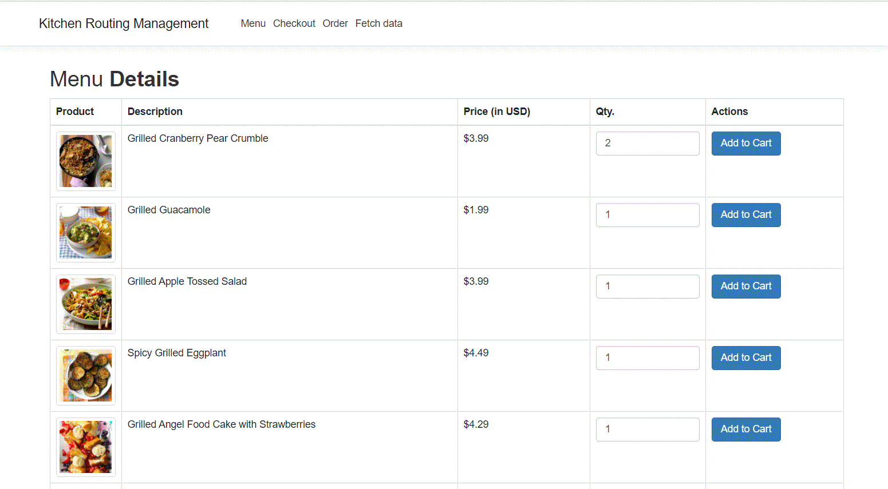
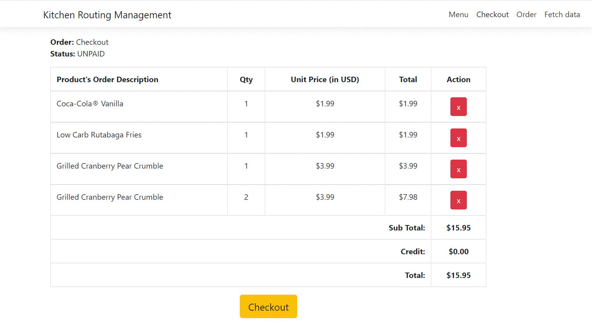

# The Kitchen Routing System
You are tasked with writing a piece of software to do a Restaurant Order Routing. Assume that you have
a restaurant with multiple POS (point-of-sale) instances sending orders that should be routed to specific
areas of a kitchen.

It must comprise a HTTP Server with an endpoint to receive an Order and place it in a queue
representing a destination kitchen area.

# Database script:
# /****** Object:  Table [dbo].[orderstatus]    Script Date: 19-01-2021 01:01:52 AM ******/
SET ANSI_NULLS ON
GO

SET QUOTED_IDENTIFIER ON
GO

CREATE TABLE [dbo].[orderstatus](
	[orderid] [nvarchar](50) NOT NULL,
	[ordercheckincode] [nchar](10) NULL,
	[status] [nvarchar](50) NOT NULL,
 CONSTRAINT [PK_orderstatus] PRIMARY KEY CLUSTERED 
(
	[orderid] ASC
)WITH (PAD_INDEX = OFF, STATISTICS_NORECOMPUTE = OFF, IGNORE_DUP_KEY = OFF, ALLOW_ROW_LOCKS = ON, ALLOW_PAGE_LOCKS = ON, OPTIMIZE_FOR_SEQUENTIAL_KEY = OFF) ON [PRIMARY]
) ON [PRIMARY]
GO

# /****** Object:  Table [dbo].[orderlineitemstatus]    Script Date: 19-01-2021 01:02:15 AM ******/
SET ANSI_NULLS ON
GO

SET QUOTED_IDENTIFIER ON
GO

CREATE TABLE [dbo].[orderlineitemstatus](
	[orderlineitemid] [nvarchar](50) NOT NULL,
	[ordercheckincode] [nchar](10) NOT NULL,
	[productname] [nvarchar](500) NOT NULL,
	[quantity] [int] NOT NULL,
	[price] [decimal](18, 2) NOT NULL,
	[producttype] [nchar](10) NOT NULL,
	[lineitemstatus] [nchar](10) NOT NULL,
	[createddate] [datetime] NULL,
 CONSTRAINT [PK_orderlineitemstatus] PRIMARY KEY CLUSTERED 
(
	[orderlineitemid] ASC
)WITH (PAD_INDEX = OFF, STATISTICS_NORECOMPUTE = OFF, IGNORE_DUP_KEY = OFF, ALLOW_ROW_LOCKS = ON, ALLOW_PAGE_LOCKS = ON, OPTIMIZE_FOR_SEQUENTIAL_KEY = OFF) ON [PRIMARY]
) ON [PRIMARY]
GO

# /****** Object:  StoredProcedure [dbo].[CartLineItems]    Script Date: 19-01-2021 01:03:16 AM ******/
SET ANSI_NULLS ON
GO
SET QUOTED_IDENTIFIER ON
GO
-- EXEC dbo.CartLineItems      
      
ALTER PROCEDURE [dbo].[CartLineItems]       
AS       
BEGIN      
     
 ;WITH CheckoutList    
 AS    
 (    
  SELECT orderid, ordercheckincode,     
    NULL AS productname, NULL AS quantity,     
    NULL AS price, NULL AS producttype, status AS     
    lineitemstatus FROM [dbo].[orderstatus]    
  WHERE status = 'checkout'    
    
  UNION ALL    
    
  SELECT CL.orderlineitemid AS orderid, CL.ordercheckincode,     
    CL.productname, CL.quantity,     
    CL.price, CL.producttype,    
    CL.lineitemstatus    
  FROM [dbo].[orderstatus] AS child    
   JOIN [dbo].[orderlineitemstatus] AS CL ON child.ordercheckincode = CL.ordercheckincode    
    AND child.status = CL.lineitemstatus    
 )    
    
 SELECT *, quantity*price AS totalPrice,    
  SUM(quantity*price) OVER (PARTITION BY ordercheckincode) AS totalsum   
 FROM CheckoutList     
 ORDER BY ordercheckincode, quantity    
END

# /****** Object:  StoredProcedure [dbo].[OrdersList]    Script Date: 19-01-2021 01:03:50 AM ******/
SET ANSI_NULLS ON
GO
SET QUOTED_IDENTIFIER ON
GO
ALTER PROCEDURE [dbo].[OrdersList]         
AS         
BEGIN   
	 ;WITH CheckoutList      
	 AS      
	 (      
	  SELECT orderid, ordercheckincode,       
		NULL AS productname, NULL AS quantity,       
		NULL AS price, NULL AS producttype, UPPER(status) AS       
		lineitemstatus FROM [dbo].[orderstatus]      
	  WHERE status <> 'checkout'      
      
	  UNION ALL      
      
	  SELECT CL.orderlineitemid AS orderid, CL.ordercheckincode,       
		CL.productname, CL.quantity,       
		CL.price, CL.producttype,      
		UPPER(CL.lineitemstatus) lineitemstatus     
	  FROM [dbo].[orderstatus] AS child      
	   JOIN [dbo].[orderlineitemstatus] AS CL ON child.ordercheckincode = CL.ordercheckincode      
		AND child.status <> CL.lineitemstatus      
	 )      
      
	 SELECT *, quantity*price AS totalPrice,      
	  SUM(quantity*price) OVER (PARTITION BY ordercheckincode) AS totalsum     
	 FROM CheckoutList       
	 ORDER BY ordercheckincode, quantity
 END

# Get menu from forntend

# Checkout order

